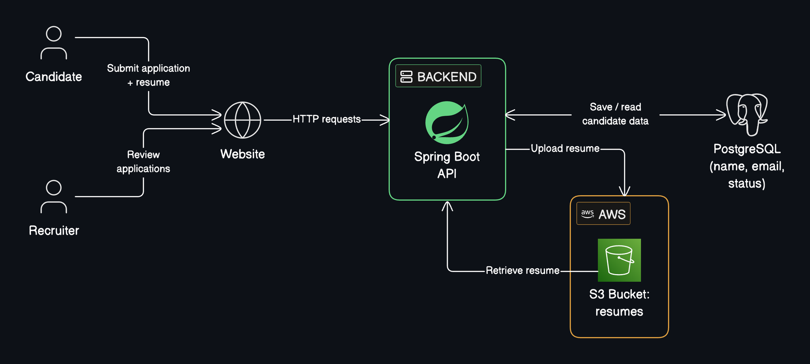

# RCE Blast Radius Lab

Companion project for the ByteMonk video **"FBI Cyberattack and Application Security"**.

A small recruitment app whose AWS role can read more than it needs. You'll see what code running inside the app could reach, then fix it with least privilege.

> **No exploit included.** The "vulnerable PDF library" is a teaching assumption. The lab tests permissions, not an attack. All data is synthetic.



The app's IAM role can also read a second bucket, the **HR employee archive**, which it never needs. That's the bug we fix.

## Prerequisites

- [Docker Desktop](https://www.docker.com/products/docker-desktop/) (or Docker Engine with Compose)
- Git

No AWS account needed. AWS (S3, IAM, STS) runs locally in an emulator.

## Run it

```bash
git clone https://github.com/bytemonk-academy/rce-least-privilege-lab.git
cd rce-least-privilege-lab
docker compose up -d --build
```

The first build takes a few minutes. Then open:

| Page | URL | Login |
|---|---|---|
| Careers site | http://localhost:8080 | none (public) |
| Recruiter console | http://localhost:8080/recruiter.html | `recruiter` / `change-me-recruiter` |

Apply with `fixtures/resumes/jane-candidate-resume.pdf`, then review it in the recruiter console.

## The experiment

**1. What can the app's identity read?**

```bash
scripts/check-access
```
```
ALLOWED  GetObject resume bucket     resumes/fixtures/jane-candidate-resume.pdf    859 bytes
ALLOWED  GetObject employee archive  employees/employee-records-SYNTHETIC.csv      376 bytes
```

**2. Apply least privilege and run the same test**

```bash
scripts/use-policy restricted
scripts/check-access
```
```
ALLOWED  GetObject resume bucket     resumes/fixtures/jane-candidate-resume.pdf    859 bytes
DENIED   GetObject employee archive  employees/employee-records-SYNTHETIC.csv      AccessDenied
```

Same app, same files. Only the IAM policy changed: compare [`infra/iam/broad.json`](infra/iam/broad.json) and [`restricted.json`](infra/iam/restricted.json).

Run both steps in one go with `scripts/demo`. Reset with `scripts/use-policy broad`.

## Clean up

```bash
docker compose down -v
```

## Troubleshooting

- **Port in use:** the app uses 8080 and the AWS emulator 5050. Use another emulator port with `LAB_EMULATOR_PORT=5151 docker compose up -d`.
- **Windows:** run `scripts/` in Git Bash or WSL, or use `docker compose run --rm lab check-access`.
- **Something odd after a restart:** `docker compose down && docker compose up -d`.

## Go deeper

The [full lab guide](docs/lab-guide.md) covers the code walkthrough, more experiments, exploring the emulator with the AWS CLI, running against a real AWS account or EC2, costs, and why permission testing is not an exploit.

MIT licensed. Built by ByteMonk for learning.
